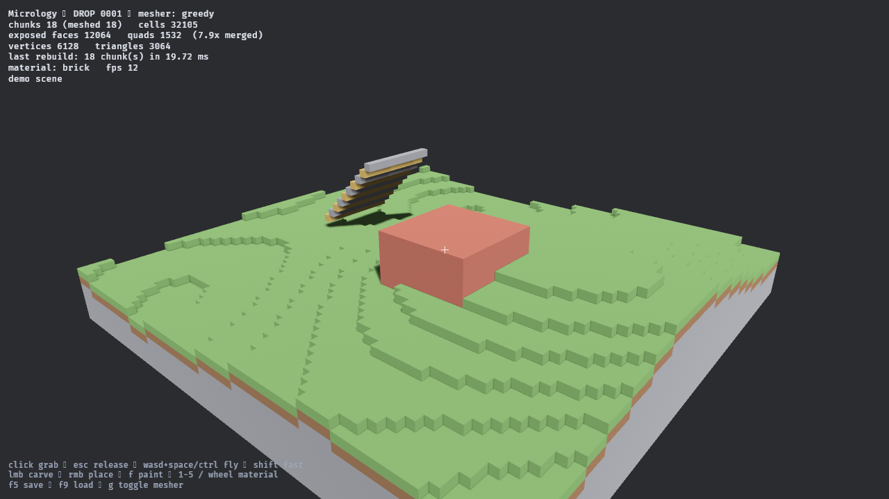

# Micrology

A standalone volumetric game engine for large, destructible, procedurally
generated worlds with very fine local geometry.

**This is an engine, not a game, and not a Minecraft mod.** Minecraft is a future
import/export format and a test ecosystem — never the foundation. No core crate
depends on Minecraft, Fabric, NBT, block entities or a block registry, and none
ever will; that belongs behind import/export adapters.

The engine is in **DROP 0005 — Material Mechanics and Structural Capacity**.
The world kernel, scale foundation and destruction system are complete:
Micrology owns, streams, edits, saves and renders its own bounded-memory
volumetric world, and destroys it exactly — structural connectivity, native
volumetric fragments, collision compiled from cell data, fragment persistence
and residency, applied damage, progressive local damage, force coupling and
bounded secondary destruction. DROP 0005 adds mechanical difference between
materials and the first model of structural capacity, and is through **0005.0**:
the mechanics crate, its fixed-point numeric type and the participation contract
that keeps every physical system optional.



*The demo scene: terraced ground, a hollow brick room, a stepped ramp. Note the
large unbroken faces — greedy meshing collapsed 12,064 exposed cell faces into
1,532 quads, so flat regions have no per-cell seams at all.*

## Quick start

```sh
cargo test              # the engine suite — seconds, no GPU needed
cargo run -p sandbox    # open the sandbox on the demo scene
```

That is the whole setup. A fresh clone needs nothing but a stable Rust toolchain
(and, on Linux, the system libraries listed below).

```sh
cargo run -p sandbox -- fixtures/worlds/drop0001_sample.json   # load a world instead
```

### Sandbox controls

| input | action |
|-------|--------|
| click | capture the mouse |
| `Esc` | release the mouse |
| `W` `A` `S` `D`, `Space`, `Ctrl` | fly |
| `Shift` | fly faster |
| left click | carve the cell under the crosshair |
| right click | place a cell against the face you are looking at |
| `F` | repaint the cell under the crosshair |
| `1`–`5`, mouse wheel | choose material |
| `F5` / `F9` | flush unsaved regions / drop everything and stream it back |
| `G` | swap the greedy mesher for the exact oracle |
| `Q` | quit, flushing unsaved edits first |

`G` is a debugging tool worth knowing about: it re-renders the world with the
simple reference extractor instead of the optimised mesher. If a visual artefact
survives the swap, the cell data is wrong, not the meshing.

Closing the window flushes unsaved edits too — `Q` exists because a key is
certain to arrive, and an unverified flush is not a flush.

### Streaming a world larger than memory

The sandbox streams whatever world directory it is given. To make one far bigger
than it can hold:

```sh
cargo run --release -p engine_stress --bin worldgen -- /tmp/world --regions 12
cargo run --release -p sandbox -- /tmp/world
```

That is 144 regions, 1,536 cells square, 57.2M cells — 153 MiB if it were ever
all resident, against a 96 MiB ceiling. Three environment variables exist so the
*shipped* application can be put under real memory pressure without a special
build; nothing reads them in normal use:

| variable | effect |
|---|---|
| `MICROLOGY_BUDGET_MB` | memory ceiling (default 96) |
| `MICROLOGY_LOAD_RADIUS` | regions fetched around the camera |
| `MICROLOGY_UNLOAD_RADIUS` | regions kept before eviction |
| `MICROLOGY_FRAGMENT_SOFT_MB` | fragment tracked-byte soft target (default 32) |
| `MICROLOGY_FRAGMENT_HARD_MB` | fragment tracked-byte ceiling (default 64) |
| `MICROLOGY_FRAGMENT_MAX_BODIES` | active fragment body cap (default 512) |
| `MICROLOGY_FRAGMENT_MAX_BOXES` | active fragment collider-box cap (default 65,536) |

### Linux system dependencies

Bevy needs these to build the sandbox. The engine crates need none of them.

```sh
sudo apt-get install -y libasound2-dev libudev-dev libwayland-dev \
                        libxkbcommon-dev libxkbcommon-x11-dev
```

`libxkbcommon-x11` is easy to miss: it is loaded at runtime rather than link time,
so leaving it out builds fine and then panics inside winit on startup.

## What exists

```text
crates/
  engine_core/      coordinates, materials, revisions, CellSource, spatial roles
  engine_volume/    one 16^3 volume of cells, palette-indexed
  engine_world/     regions own volumes; editing, dirty tracking, raycast
  engine_geometry/  surface extraction, greedy meshing, per-section mesh cache
  engine_io/        versioned save/load, v1 file and v2 sharded directory
  engine_stream/    residency, async mesh jobs, scheduling, the memory budget
  engine_destruction/ support, connectivity, fragments, collision compilation
  engine_stress/    deterministic scenarios, granularity audit, world generator
apps/
  sandbox/          desktop host: rendering, streaming and Avian static physics
fixtures/           committed worlds and stress baselines, to prove stability
docs/               architecture, save format, testing, drop reports, the vision pack
```

The crates form a strict line: `core <- volume <- world`, with `geometry`
depending only on `core`, `io` and `stream` on top. Geometry does not know how
cells are stored and the engine does not know what a renderer is. Bevy appears in
exactly one place — `apps/sandbox` — and `apps/sandbox/src/render.rs` is the only
file where engine geometry meets a graphics API. `cargo test` never builds Bevy,
because `sandbox` is excluded from the workspace's `default-members`.

### The five ideas that matter

**Cells are data, never entities.** A 16³ volume is `u16` palette indices, 8 KiB
at its most expensive, and nothing at all when it is empty or uniform. Nothing in
the engine will ever model a cell as an ECS entity or a rigid body.

**Volume seams are not render boundaries.** Meshers read cells in *global* space
through one trait, so they sample a cell past the volume they are compiling. A
face shared with a solid neighbour is never emitted. Two solid volumes side by
side lose all 512 faces at their seam.

**There is always an oracle.** `ExactCompiler` emits one quad per exposed face and
is kept permanently. `GreedyCompiler` merges coplanar same-material rectangles — a
solid volume collapses from 1536 faces to 6 quads. The tests expand the merged
output back into unit faces and demand it match the oracle exactly, over seeded
pseudo-random worlds at every density. Optimised geometry is only trustworthy
while something simple stands beside it.

**Rebuilds are local.** Editing one cell re-meshes one render section. An edit on
a volume boundary also re-meshes the touching neighbour, because clearing a seam
cell exposes a face that belongs to the neighbour's mesh — the subtle half of the
promise, and the one that leaves holes at seams when it is missed.

**Storage, residency and rendering are different units.** A 16³ volume is the
storage leaf. A region is what gets loaded, evicted and saved. A render section is
what gets meshed and drawn. They happen to line up today; nothing is allowed to
assume they always will.

**The world is streamed, and bounded in bytes.** Regions load and evict around
the camera, meshing happens on worker threads, and a memory budget decides what
may stay — denominated in bytes, because mesh cost per cell spans four orders of
magnitude between solid terrain and a checkerboard, so counting regions would be
wrong by that factor. Verified on a 153 MiB world held inside a 24 MiB ceiling.

## What does not exist yet

Still not implemented: live detachment feeding dynamic fragment bodies, fragment persistence/spatial streaming, the interactive structural-destruction pipeline, LOD, an editor,
procedural generation, scripting, networking, multiplayer, Minecraft or
Litematica import/export, GIS ingestion, volume transforms, and any actual game.

Static collision is live in the sandbox through Avian, but physics backend types
remain outside all engine crates.

DROP 0002 (scale: regions, streaming, async meshing, memory budget) is
**complete** — see [the report](docs/drop-0002-report.md). DROP 0003 (structural
destruction: connectivity, volumetric fragments, collision, physics) and DROP
0004 (destruction at scale, applied damage, force coupling, re-fracture, chaos)
are **complete**. DROP 0005 (material mechanics and structural capacity) is in
progress — [`docs/drop-0005.md`](docs/drop-0005.md) tracks it pass by pass.

No physical system is mandatory for a valid world. A floating island or an
impossible castle is valid authored data and does not need a fake
infinite-strength material to stay up; gravity, anchoring, connectivity
detachment, damage, fragment physics and mechanics are separable and
individually optional.

## Documentation

| document | contents |
|----------|----------|
| [`docs/architecture.md`](docs/architecture.md) | how the crates fit together, and why the boundaries sit where they do |
| [`docs/native-world-format.md`](docs/native-world-format.md) | the save format, field by field, and how to evolve it |
| [`docs/testing.md`](docs/testing.md) | what is covered, and how to add a case |
| [`docs/drop-0001.md`](docs/drop-0001.md) | DROP 0001 status, limitations, verification |
| [`docs/drop-0002-scope.md`](docs/drop-0002-scope.md) | DROP 0002 scope: scale, regions, streaming |
| [`docs/drop-0002.md`](docs/drop-0002.md) | DROP 0002 pass by pass, with every measurement taken |
| [`docs/drop-0002-report.md`](docs/drop-0002-report.md) | DROP 0002 report: what shipped, what it measures, what DROP 0003 inherits |
| [`docs/drop-0003-scope.md`](docs/drop-0003-scope.md) | DROP 0003 scope: structural destruction and volumetric fragments |
| [`docs/drop-0003.md`](docs/drop-0003.md) | DROP 0003 pass by pass |
| [`docs/drop-0004-scope.md`](docs/drop-0004-scope.md) | DROP 0004 scope: destruction at scale and applied damage |
| [`docs/drop-0004.md`](docs/drop-0004.md) | DROP 0004 pass by pass |
| [`docs/drop-0005-scope.md`](docs/drop-0005-scope.md) | DROP 0005 scope: material mechanics and structural capacity |
| [`docs/drop-0005.md`](docs/drop-0005.md) | DROP 0005 pass by pass |
| [`docs/vision/`](docs/vision/) | the original project brief, preserved verbatim |
| [`CLAUDE.md`](CLAUDE.md) | guardrails for anyone — human or agent — changing this repo |

## Lineage

The ideas here were proven in [`astra-microblocks`](https://github.com/behemothnemoth-a11y/astra-microblocks):
a 16³ microcell volume, mixed materials in one volume, native RGB materials,
deterministic greedy face merging, exact geometry preservation, and the habit of
validating an optimised mesher against a unit-face topology oracle. What is *not*
carried over is the Minecraft architecture those ideas were trapped in. This
engine owns its own batching, buffering, cross-volume occlusion, rebuild
scheduling and persistence.

## Licence

Dual-licensed under [MIT](LICENSE-MIT) or [Apache 2.0](LICENSE-APACHE), at your
option.
