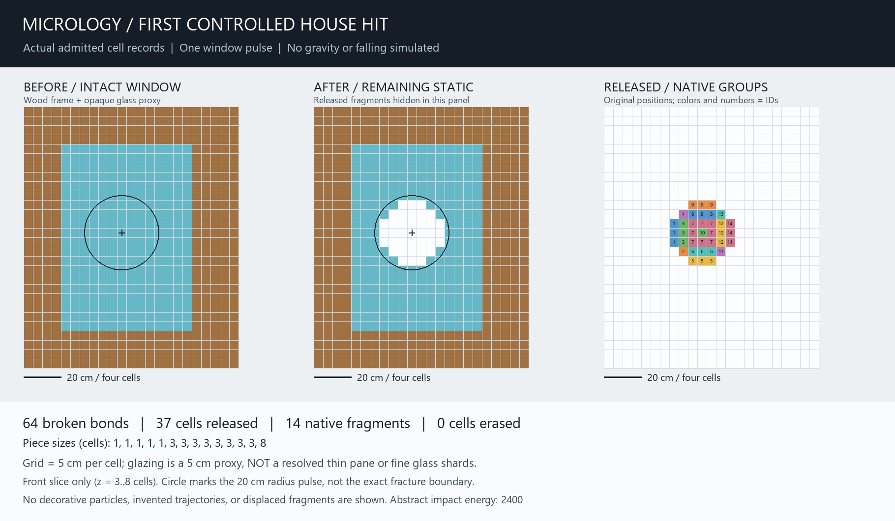

# Reference house - Step 7 first controlled window impact

Date: 2026-10-03.
Base: `162b0a2f2ea943f58c588bfab2ec0abfe8c53c9b` (static house Step 6).
Branch: `chatgpt/house-impact-step7-20261003`.
Scope: one headless local pulse, admitted native fragments, exact cell accounting,
and before/after inspection. No automatic merge, full demolition, physics time
steps, retuned materials, finer-fracture model, live sandbox change or new video.

## Executed scenario

`engine_stress::house_impact` builds a disposable state from a clone of the exact
Step 6 house. No source save is loaded, edited, or overwritten. Four material
presets are explicitly supplied via the Step 4 immutable owned-policy worker.
This is one fixed radial pulse, not a physical projectile collision:

- Front-right window center vicinity: `(98.5, 35.5, 4.5)` in cell coordinates.
- Radius: 4 cells; energy: 2,400 abstract engine units.
- The original 50 mm/cell annotation makes the radius 200 mm. The 2,400 energy
  is NOT converted from the Step 5 specimen's different cell scale, not joules.
- No coefficients, support masks, house geometry, or partition settings change.
- No gravity, rigid-body stepping, motion injection, or secondary impact runs.

The source contains 167,192 cells. Following the admitted hit:

| Measurement | Actual result |
|---|---:|
| Broken bonds this hit | 64 |
| Cells released into native fragments | 37 |
| Native fragments | 14 |
| Explicitly erased/crushed cells | 0 |
| Remaining static cells | 167,155 |
| Loaded cells / bonds | 45 / 104 |
| Fracture propagation cells visited / bonds considered | 69 / 104 |
| Largest fragment / median | 8 cells / 3 cells |

Sizes: five 1-cell pieces, eight 3-cell pieces, one 8-cell piece. The largest
piece's bounding extent is 1 x 3 x 3 cells, or 50 x 150 x 150 mm at this fixture's
annotation. That is NOT a realistic thin glass shard. Its eight cells occupy an
irregular subset of that bounding box; the ninth cell is a separate fragment.

Every released cell belongs to this one glass proxy. Every wood, masonry and
concrete cell remains exactly the same, as does every authored anchor. All
surviving material has exactly one owner across static data and native fragments;
there are no invented, duplicated, relocated, or silently discarded cells.
The identity is 167,192 = 167,155 static + 37 fragment + 0 erased.

The pulse is intentionally centered away from the timber border. It proves
isolation, not an actual loaded mixed-material joint or cross-material collapse.

## Important finding: ordinary live limits do NOT admit the full fixture

The existing job default allows 128 occupied volumes. This house requires 229.
The default therefore refuses capture, leaving authority unchanged. Increasing
only the volume allowance still results in `StructureInconclusive` with the
existing 65,536-cell classification budget. These are actual regression tests,
not inferred explanations or reasons to bypass conservative classification.

The offline diagnostic declares its own FINITE allowances:

| Budget | This diagnostic |
|---|---:|
| Snapshot volume limit | 256 |
| Geometry snapshot byte limit | 4,194,304 (unchanged from default) |
| Structure cells per component / total | 262,144 / 262,144 |
| Structure components | 512 |
| Admission pieces / total fragment cells | 256 / 4,096 |

All other limits remain their existing defaults. This is a fixture allowance,
NOT a runtime tuning decision or a claim that increasing caps solves scaling.
The world copy has an engine-reported geometry footprint of 1,908,192 bytes,
covering 229 volumes. This metric is the engine's footprint accounting, not total
process/allocator memory. The pristine input has zero fracture history records.
The extra read-only load evaluation exposes diagnostics; it is not hidden inside
a claimed worker performance measurement.

A 173-unit fracture propagation workload still requires a much wider structural
context here. Propagation work is NOT total connectivity/commit cost. This pass
does not add topology-work counters or claim local connectivity scaling. Before
live house demolition, review request sizing, connected-region context and
bounded structural work rather than truncating unknown geometry to make it fit.
The default sandbox and all prior benchmarks remain untouched.

## Inspection image



This is a deterministic front-slice cell-record diagram, NOT game/GPU footage.
The left panel reads intact cell positions, the center reads remaining static
cells, and the right reads exact admitted fragment memberships in their original
source coordinates. Numbers and colors identify native objects. The center
hides the released objects to reveal the opening; the right panel accounts for
them. No picture claims they have fallen or moved. The circle is the pulse radius,
not an imposed circular cut or a claimed exact fracture boundary.

Glazing remains an opaque 50 mm voxel proxy. No glass bending, pane model, sharp
shard geometry, cosmetic particles, blast algorithm change, or fine debris layer
has been added. This is evidence of local fracture and ownership, not realism.

`tools/render-house-impact-preview.py` reads only the exported report, labels
its inspection type, and refuses existing output files. Source and image hashes
are recorded in `window-preview-provenance.json`. The before/after surface JSON
exports are separate actual GreedyCompiler outputs, with after-hit and native
piece surfaces tested against ExactCompiler. They are not an incomplete world
save advertised as a complete, reloadable destruction session.

## Reproduce

```sh
cargo run --locked -q -p engine_stress --bin house_window_bench
cargo run --locked -q -p engine_stress --bin house_window_bench -- --check
cargo run --locked -q -p engine_stress --bin house_window_bench -- --export target/house-window-impact-NEW
python tools/render-house-impact-preview.py target/house-window-impact-NEW
cargo test --locked -p engine_stress --test house_window_impact
```

The CLI rejects invalid arguments and existing export directories. `--write-new`
uses `create_new`, for the FIRST baseline only; it cannot overwrite a baseline.
The new numeric result is `fixtures/destruction/reference-house-window-hit-v1.json`.
The baseline includes exact source-cell membership, not only counts/checksums.
It is checked by ordinary engine tests. No older baseline was regenerated.

## Verification

Executed on Windows MSI: **857 engine all-target tests passed**, including
all 12 new house-impact tests; one documentation test passed. Formatting,
engine Clippy, sandbox Clippy, whitespace, the new window-hit baseline and
existing material/destruction/replay/distribution/locality checks passed.
Pre-existing golden files remain unchanged. The new baseline overwrite attempt
refused and left its hash unchanged. A final export from the verified source
matched the rendered report and both surface files byte-for-byte.

Evidence is in `docs/diagnostics/house_impact_step7_20261003/`.
`verification.json` records commands, return codes, source hashes and raw-log
hashes. Committed log excerpts are normalized to LF and trimmed at EOF; the
hashes refer to original raw logs in the isolated worktree's
`target/house-impact-step7-verification`. No time limit or performance threshold
is asserted by these counts.

The 12 new tests cover intact-source/non-glass/anchor preservation, exact cell
accounting and fragment sizes, ordinary volume and structure refusal, independent
byte/work refusals, unknown residency, atomic admission, stale repaint, direct
versus worker equivalence, independent repeated results, measured baseline,
post-impact/native-piece surface oracle equivalence, and export non-overwrite.
The source-hash verification identifies the exact tested working files.

No local sandbox runtime/GPU acceptance or live house interaction was performed.
Independent Actions results must be checked separately. Previous Step 6 Actions
run 215 was checked this session: both engine and sandbox jobs completed
successfully, including its fixed-step contact replay. That does not validate
this new house scenario's runtime physics.

## Stop and next boundary

One window hit only. No chimney strike, timber support cut, roof collapse,
multiple-scene matrix, new materials, or live demo integration belongs here.
The next engineering review should handle the demonstrated house-sized snapshot
and connectivity limits before enabling live house demolition. Keep finite
budgets and unknown/inconclusive refusal semantics; do not present the offline
allowance as an optimization. A timber/glass boundary hit remains a separate
controlled scenario, not something this centered pane test has already proved.
