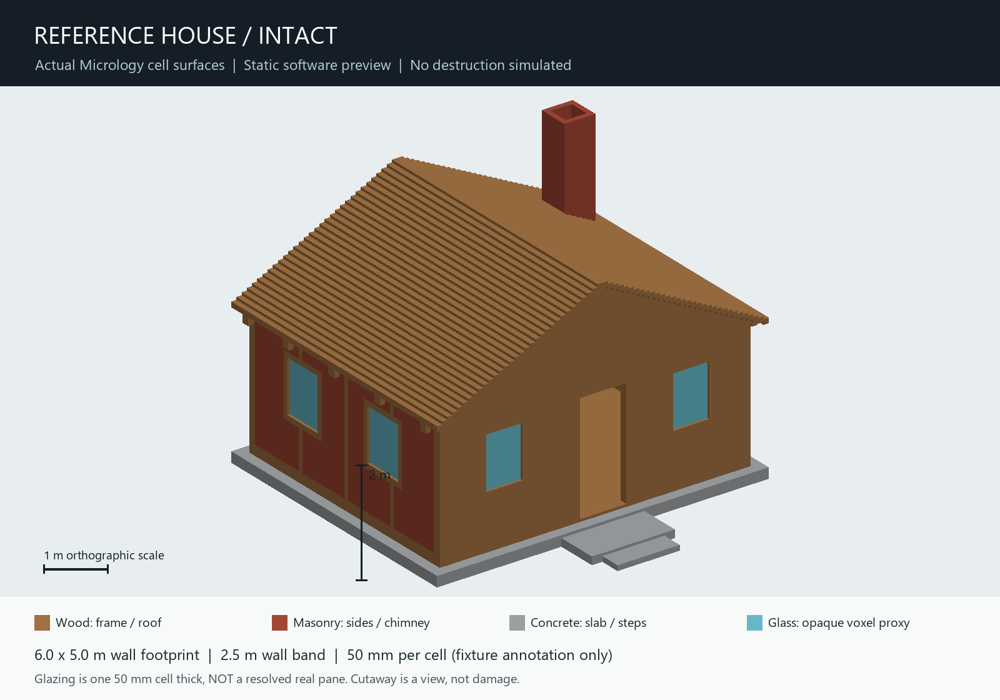
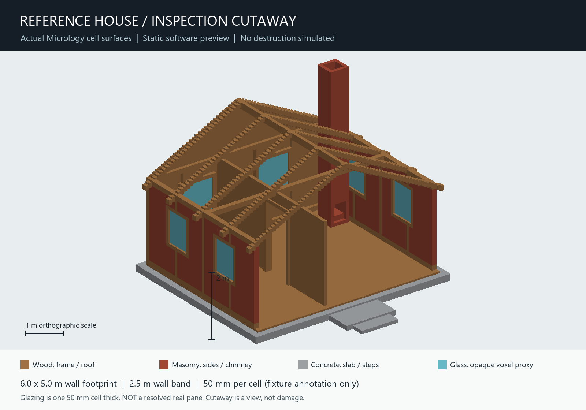

# Reference house - Step 6 static inspection checkpoint

Date: 2026-10-03.
Base: `70235dafdd8c2501d439d7e976181b5a2fb61796` (reference specimens Step 5).
Branch: `chatgpt/house-static-step6-20261003`.
Scope: static geometry, explicit scale annotations, material placement, native
save/reload and inspection images. No house demolition, new video, runtime
physics, material calibration, finer-fracture rule, or automatic merge.

## Built fixture

`engine_stress::reference_house::build()` creates an ordinary native World from
deterministic cell operations. Four caller-assigned material IDs (101-104) are
used: wood, masonry, concrete, and glass. Appearance is a flat inspection palette;
there are no imported game assets or third-party house models.

The layout is an original diagnostic timber/masonry cottage, NOT a reproduction
of a real building, code-compliant construction design or structural calculation.

| Quantity | This fixture's annotation |
|---|---|
| Cell edge | 50 mm |
| Outer-wall footprint | 6,000 x 5,000 mm |
| Concrete slab | 6,400 x 5,400 x 200 mm |
| Floor top above underside | 250 mm |
| Wall band above floor | 2,500 mm |
| Open front doorway | 900 x 2,100 mm |
| Reference timber-post section | 100 x 150 mm (2 x 3 cells) |
| Glazing proxy thickness | 50 mm (1 cell; NOT a resolved real pane) |
| Highest roof surface | 4,350 mm above underside |
| Chimney top | 4,850 mm above underside |

Wood supplies the floor, front/rear facades, posts, plates, window frames,
interior partition and doorway, cross-beam, rafters, ridge and stepped roof
sheathing. Masonry supplies side-wall infill and a hollow chimney with a fireplace
opening. Concrete supplies slab, porch and steps. Eight framed window openings
carry glass proxies. One larger open room and a smaller side room connect through
an interior doorway. The chimney is hollow through its top, not a solid pillar.

The 50 mm grid is an explicit first inspection choice: posts have multiple cells
across their section without multiplying this small checkpoint into millions of
occupied cells. It is half the Step 5 coupon's 100 mm annotation, NOT a globally
changed engine resolution or a proven optimum. Sloped wood is still stepped.
Glazing is deliberately thick and opaque in the preview. Thin-pane representation,
real mass/force/energy scaling and realistic member/joint behavior remain open.
Do not simply apply the coupon's numbers at this new cell scale and call them
physically equivalent. The underlying engine coordinates still count cells.

## Native geometry measurements

- Occupied cells: **167,192**.
- Wood: 81,076; concrete: 57,216; masonry: 26,260; glass proxy: 2,640.
- Explicit anchored underside cells: 14,528, all occupied concrete at y=0.
- Occupied storage volumes: 229.
- Exposed unit faces: 145,460; compiled greedy quads: 5,935.
- Structural geometry checksum: `0914c4bcec7ce205`.

Support is a separately authored underside mask, not a property of concrete.
An exact occupancy check confirms one face-connected assembly. This does NOT
prove that the building carries loads or collapses correctly. No dynamic native
fragments, bond history, impacts, collapse events or simulation steps are created.
There is no entity or rigid body per cell. No renderer/backend enters an engine
crate, and no existing topology or material model changes.

## What the images are





These are software inspection renders of the **actual GreedyCompiler quads from
this World**, not image-generation concepts, a substitute artist model, a new
video, or screenshots of the running Bevy/NVIDIA sandbox. The complete exposed
face sets are tested against the independent ExactCompiler for both views.

`cutaway()` subtracts roof sheathing and the front facade from a CLONE. Rafters,
interior division, window placement and chimney remain visible. It is not a
simulated damaged state. The intact world's cells and support remain unchanged.
Both images use the same orthographic camera and scale. The 1 m ruler and 2 m
upright are annotations only, not extra materials or geometry in the world.

The Python renderer only reads exported surface JSON. It uses a depth buffer and
flat directional shading, has no physics, and does not alter native saves.
`preview-provenance.json` records source/image hashes and labels the output type.
The script uses already-installed Pillow and NumPy; no engine dependency added.

## Generate a disposable native world

From the repository root (the parent `target` directory must exist):

```sh
cargo run --locked -q -p engine_stress --bin reference_house_fixture
cargo run --locked -q -p engine_stress --bin reference_house_fixture -- --export target/reference-house-static-v1
python tools/render-house-preview.py target/reference-house-static-v1
cargo test --locked -p engine_stress --test reference_house
```

`--export` requires a NEW destination and refuses an existing directory, even an
empty one. It writes `native-world/` using the existing native directory format,
`manifest.json` with diagnostic dimensions/counts, and two compiled-surface JSON
files. Its metadata includes a house-framing camera position and target in cells.
It does not open the sandbox or overwrite an authored world. Failed creation may
leave its NEW partial export for inspection; it never cleans an existing save.
The preview script also refuses existing final PNG/provenance files.

`Micrology_Static_Reference_House_v1.zip` in this checkpoint's diagnostics includes
the native world, dimensions, two previews, provenance and usage notes. The native
world contains no fracture/fragment state and does not activate material policies.
Source and numeric layout baseline are the reproducible authority; the images
are inspection aids. Review the intact fixture before any demolition scenario.

## Verification

Executed on the Windows MSI. **845 engine all-target tests passed**, INCLUDING
the 10 new house tests, plus 1 documentation test. Formatting, whitespace,
engine Clippy and sandbox Clippy all passed. The existing material-specimen,
destruction benchmark/replay, fragment distribution and locality checks passed;
all pre-existing goldens remain unchanged. No physical behavior was retuned.

The new tests cover four IDs/bounded cells; open rooms/doors/flue; one-cell
glazing and timber borders; underside-only support; exact face connectivity;
cutaway isolation/subset; greedy/exact face equality; native save/reload;
existing-destination refusal; and deterministic layout baseline comparison.

The final compiled export was generated again into a NEW directory after the
Clippy-only iterator cleanup. Both surface JSON files, the dimension manifest
and all three native-save files were **byte-identical** to those used for the
images. `export-recheck.json` records this check. `verification.json` records
commands, exit codes and LF-normalized source hashes; source stability was
checked during verification and before packaging. Committed text evidence uses LF line endings and trimmed terminal whitespace;
log hashes refer to the original raw logs, not the normalized text excerpts.
Full raw logs remain under
`target/house-static-step6-verification` in the isolated worktree.

No sandbox runtime, interactive GPU, house-load/collapse or frame-rate
acceptance was run. The images are static software previews, not game capture.
Independent GitHub Actions status must be checked separately before calling it
passed. This checkpoint does not modify the sandbox's default behavior.

## Stop boundary

This completes the STATIC house checkpoint only. The next review concerns the
visible proportions, framing, openings, glazing proxy and cell scale. Material
mass/scale, house load capacity, fine debris and staged destruction still require
separate evidence. Do not treat these images as proof of any destruction result.
